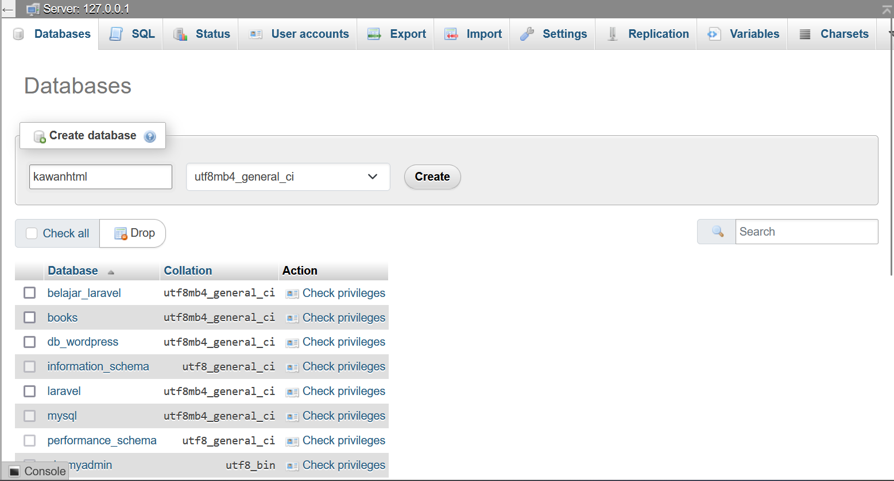
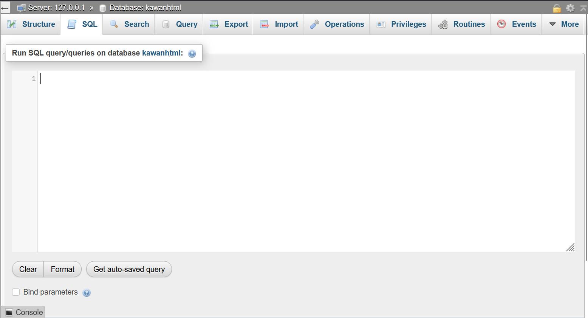

# Proyek Laravel PMW

## Langkah-langkah Instalasi

1. Clone repositori:
    ```bash
    git clone https://github.com/Kawan-HTML/kawanhtml
    ```

2. Masuk ke repositori:
    ```bash
    cd kawanhtml
    ```

3. Salin file `.env.example` menjadi `.env`:
    ```bash
    cp .env.example .env
    ```

4. Install dependencies PHP menggunakan Composer:
    ```bash
    composer install
    ```

5. Buat app key:
    ```bash
    php artisan key:generate
    ```

## Langkah-langkah Setup Database MySQL

1. Aktifkan XAMPP seperti pada gambar ini
    

2. Buka phpMyAdmin di browser:
    [http://localhost/phpmyadmin/](http://localhost/phpmyadmin/)

3. Klik menu 'Databases' dan buat database `kawanhtml` seperti pada gambar:
    

4. Klik menu 'SQL':
    

5. Salin query berikut dan paste di SQL:
    ```sql
    -- phpMyAdmin SQL Dump
    -- version 5.2.1
    -- https://www.phpmyadmin.net/
    --
    -- Host: 127.0.0.1
    -- Generation Time: Jul 18, 2024 at 01:34 PM
    -- Server version: 10.4.32-MariaDB
    -- PHP Version: 8.2.12

    SET SQL_MODE = "NO_AUTO_VALUE_ON_ZERO";
    START TRANSACTION;
    SET time_zone = "+00:00";

    /*!40101 SET @OLD_CHARACTER_SET_CLIENT=@@CHARACTER_SET_CLIENT */;
    /*!40101 SET @OLD_CHARACTER_SET_RESULTS=@@CHARACTER_SET_RESULTS */;
    /*!40101 SET @OLD_COLLATION_CONNECTION=@@COLLATION_CONNECTION */;
    /*!40101 SET NAMES utf8mb4 */;

    --
    -- Database: `kawanhtml`
    --

    -- --------------------------------------------------------

    --
    -- Table structure for table `cache`
    --

    CREATE TABLE `cache` (
    `key` varchar(255) NOT NULL,
    `value` mediumtext NOT NULL,
    `expiration` int(11) NOT NULL
    ) ENGINE=InnoDB DEFAULT CHARSET=utf8mb4 COLLATE=utf8mb4_unicode_ci;

    -- --------------------------------------------------------

    --
    -- Table structure for table `cache_locks`
    --

    CREATE TABLE `cache_locks` (
    `key` varchar(255) NOT NULL,
    `owner` varchar(255) NOT NULL,
    `expiration` int(11) NOT NULL
    ) ENGINE=InnoDB DEFAULT CHARSET=utf8mb4 COLLATE=utf8mb4_unicode_ci;

    -- --------------------------------------------------------

    --
    -- Table structure for table `failed_jobs`
    --

    CREATE TABLE `failed_jobs` (
    `id` bigint(20) UNSIGNED NOT NULL,
    `uuid` varchar(255) NOT NULL,
    `connection` text NOT NULL,
    `queue` text NOT NULL,
    `payload` longtext NOT NULL,
    `exception` longtext NOT NULL,
    `failed_at` timestamp NOT NULL DEFAULT current_timestamp()
    ) ENGINE=InnoDB DEFAULT CHARSET=utf8mb4 COLLATE=utf8mb4_unicode_ci;

    -- --------------------------------------------------------

    --
    -- Table structure for table `jobs`
    --

    CREATE TABLE `jobs` (
    `id` bigint(20) UNSIGNED NOT NULL,
    `queue` varchar(255) NOT NULL,
    `payload` longtext NOT NULL,
    `attempts` tinyint(3) UNSIGNED NOT NULL,
    `reserved_at` int(10) UNSIGNED DEFAULT NULL,
    `available_at` int(10) UNSIGNED NOT NULL,
    `created_at` int(10) UNSIGNED NOT NULL
    ) ENGINE=InnoDB DEFAULT CHARSET=utf8mb4 COLLATE=utf8mb4_unicode_ci;

    -- --------------------------------------------------------

    --
    -- Table structure for table `job_batches`
    --

    CREATE TABLE `job_batches` (
    `id` varchar(255) NOT NULL,
    `name` varchar(255) NOT NULL,
    `total_jobs` int(11) NOT NULL,
    `pending_jobs` int(11) NOT NULL,
    `failed_jobs` int(11) NOT NULL,
    `failed_job_ids` longtext NOT NULL,
    `options` mediumtext DEFAULT NULL,
    `cancelled_at` int(11) DEFAULT NULL,
    `created_at` int(11) NOT NULL,
    `finished_at` int(11) DEFAULT NULL
    ) ENGINE=InnoDB DEFAULT CHARSET=utf8mb4 COLLATE=utf8mb4_unicode_ci;

    -- --------------------------------------------------------

    --
    -- Table structure for table `migrations`
    --

    CREATE TABLE `migrations` (
    `id` int(10) UNSIGNED NOT NULL,
    `migration` varchar(255) NOT NULL,
    `batch` int(11) NOT NULL
    ) ENGINE=InnoDB DEFAULT CHARSET=utf8mb4 COLLATE=utf8mb4_unicode_ci;

    --
    -- Dumping data for table `migrations`
    --

    INSERT INTO `migrations` (`id`, `migration`, `batch`) VALUES
    (1, '0001_01_01_000000_create_users_table', 1),
    (2, '0001_01_01_000001_create_cache_table', 1),
    (3, '0001_01_01_000002_create_jobs_table', 1);

    -- --------------------------------------------------------

    --
    -- Table structure for table `password_reset_tokens`
    --

    CREATE TABLE `password_reset_tokens` (
    `email` varchar(255) NOT NULL,
    `token` varchar(255) NOT NULL,
    `created_at` timestamp NULL DEFAULT NULL
    ) ENGINE=InnoDB DEFAULT CHARSET=utf8mb4 COLLATE=utf8mb4_unicode_ci;

    -- --------------------------------------------------------

    --
    -- Table structure for table `sessions`
    --

    CREATE TABLE `sessions` (
    `id` varchar(255) NOT NULL,
    `user_id` bigint(20) UNSIGNED DEFAULT NULL,
    `ip_address` varchar(45) DEFAULT NULL,
    `user_agent` text DEFAULT NULL,
    `payload` longtext NOT NULL,
    `last_activity` int(11) NOT NULL
    ) ENGINE=InnoDB DEFAULT CHARSET=utf8mb4 COLLATE=utf8mb4_unicode_ci;

    --
    -- Dumping data for table `sessions`
    --

    INSERT INTO `sessions` (`id`, `user_id`, `ip_address`, `user_agent`, `payload`, `last_activity`) VALUES
    ('2lz2AhjhR6hdf88sif8WlJZxh98O5gVs8issTdkM', NULL, '127.0.0.1', 'Mozilla/5.0 (Windows NT 10.0; Win64; x64; rv:128.0) Gecko/20100101 Firefox/128.0', 'YTo0OntzOjY6Il90b2tlbiI7czo0MDoiY3Y1TFlnOE1HWXZFbjQ0OVFsZ2xQakFKenAzcHYyaEFRVFdTaWRBYiI7czo5OiJfcHJldmlvdXMiO2E6MTp7czozOiJ1cmwiO3M6MzM6Imh0dHA6Ly8xMjcuMC4wLjE6ODAwMC9hdXRoL2dvb2dsZSI7fXM6NjoiX2ZsYXNoIjthOjI6e3M6Mzoib2xkIjthOjA6e31zOjM6Im5ldyI7YTowOnt9fXM6NToic3RhdGUiO3M6NDA6Im9BbmpJYno2NFNoRTdRanRjSThueVBqT1RBV3Z3ZjhpOWpQSHFjRmciO30=', 1720982139),
    ('fAqdwdtZDZsYuCpsEriUAEBS9RH0FOdJE204MJDZ', NULL, '127.0.0.1', 'Mozilla/5.0 (Windows NT 10.0; Win64; x64; rv:128.0) Gecko/20100101 Firefox/128.0', 'YTo0OntzOjY6Il90b2tlbiI7czo0MDoiaUdnc3VsWk0xZ3NpMGNpYVlUcEFVc2NkTk5ab0VmTm1DV1FsOGU3NyI7czo5OiJfcHJldmlvdXMiO2E6MTp7czozOiJ1cmwiO3M6MjE6Imh0dHA6Ly8xMjcuMC4wLjE6ODAwMCI7fXM6NjoiX2ZsYXNoIjthOjI6e3M6Mzoib2xkIjthOjA6e31zOjM6Im5ldyI7YTowOnt9fX1zOjU6InN0YXRlIjtzOjQwOiJvQW5qSWJ6NjRTaEU3UWp0Y0k4bnlQak9UQVd2d2Y4aTlqUEhxY0ZnIjt9', 1720982824);

    --
    -- Indexes for dumped tables
    --

    --
    -- Indexes for table `cache`
    --
    ALTER TABLE `cache`
    ADD PRIMARY KEY (`key`);

    --
    -- Indexes for table `cache_locks`
    --
    ALTER TABLE `cache_locks`
    ADD PRIMARY KEY (`key`);

    --
    -- Indexes for table `failed_jobs`
    --
    ALTER TABLE `failed_jobs`
    ADD PRIMARY KEY (`id`),
    ADD UNIQUE KEY `failed_jobs_uuid_unique` (`uuid`);

    --
    -- Indexes for table `jobs`
    --
    ALTER TABLE `jobs`
    ADD PRIMARY KEY (`id`),
    ADD KEY `jobs_queue_index` (`queue`);

    --
    -- Indexes for table `job_batches`
    --
    ALTER TABLE `job_batches`
    ADD PRIMARY KEY (`id`);

    --
    -- Indexes for table `migrations`
    --
    ALTER TABLE `migrations`
    ADD PRIMARY KEY (`id`);

    --
    -- Indexes for table `password_reset_tokens`
    --
    ALTER TABLE `password_reset_tokens`
    ADD PRIMARY KEY (`email`);

    --
    -- Indexes for table `sessions`
    --
    ALTER TABLE `sessions`
    ADD PRIMARY KEY (`id`),
    ADD KEY `sessions_user_id_index` (`user_id`);

    --
    -- AUTO_INCREMENT for dumped tables
    --

    --
    -- AUTO_INCREMENT for table `failed_jobs`
    --
    ALTER TABLE `failed_jobs`
    MODIFY `id` bigint(20) UNSIGNED NOT NULL AUTO_INCREMENT;

    --
    -- AUTO_INCREMENT for table `jobs`
    --
    ALTER TABLE `jobs`
    MODIFY `id` bigint(20) UNSIGNED NOT NULL AUTO_INCREMENT;

    --
    -- AUTO_INCREMENT for table `migrations`
    --
    ALTER TABLE `migrations`
    MODIFY `id` int(10) UNSIGNED NOT NULL AUTO_INCREMENT, AUTO_INCREMENT=4;
    /*!40101 SET CHARACTER_SET_CLIENT=@OLD_CHARACTER_SET_CLIENT */;
    /*!40101 SET CHARACTER_SET_RESULTS=@OLD_CHARACTER_SET_RESULTS */;
    /*!40101 SET COLLATION_CONNECTION=@OLD_COLLATION_CONNECTION */;
    COMMIT;
    ```

6. Klik tombol 'Go' untuk menjalankan query.

7. Atur file `.env` sesuai konfigurasi berikut:
    ```env
    DB_CONNECTION=mysql
    DB_HOST=127.0.0.1
    DB_PORT=3306
    DB_DATABASE=kawanhtml
    DB_USERNAME=root
    DB_PASSWORD=
    ```

8. Jalankan server Laravel:
    ```bash
    php artisan serve
    ```

9. Buka aplikasi di browser:
    [http://localhost:8000](http://localhost:8000)
